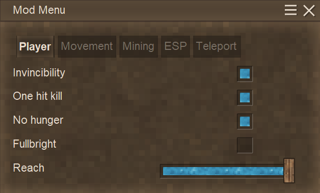
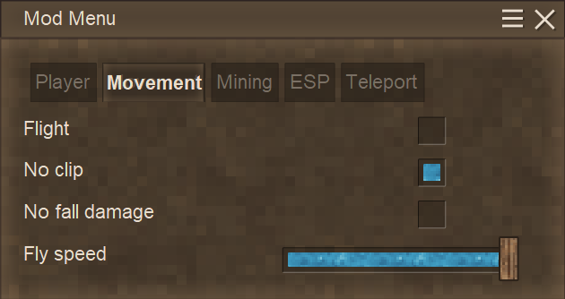
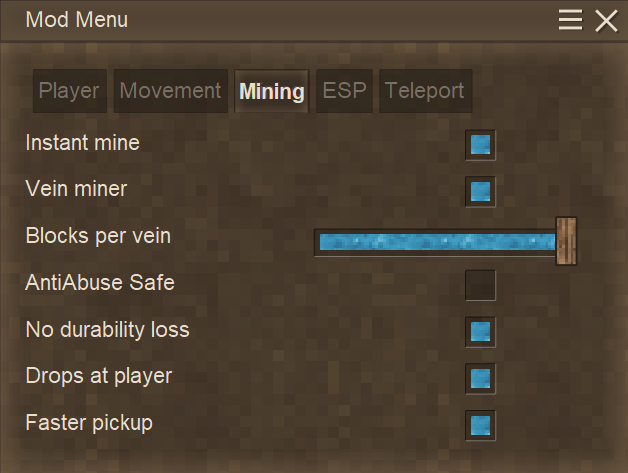
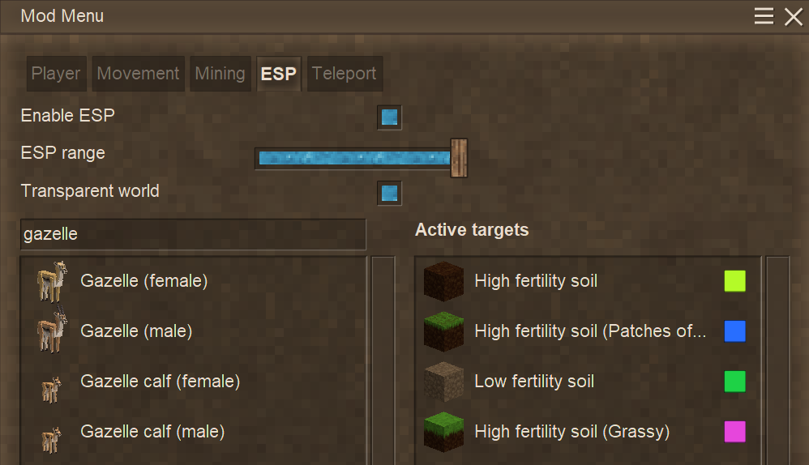
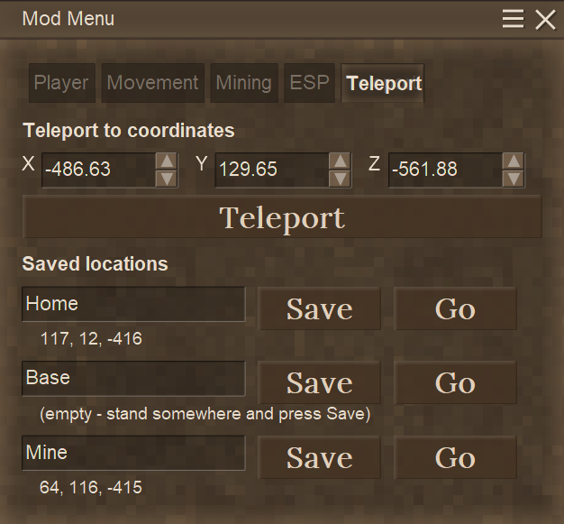

# Mod Menu

A client-side utility menu for Vintage Story 1.22. Press **F2** in game to open it.











Five tabs - Player, Movement, Mining, ESP, Teleport - because as one column it outgrew the screen
at larger GUI scales. A tab that still does not fit splits into a second column rather than
running off the bottom. Greyed switches are the ones this server cannot honour; hovering says why.

## Features

- **Invincibility** — blocks all incoming damage
- **One hit kill** — anything you hit dies
- **No hunger** — saturation stops draining
- **Fullbright** — unlit caves become readable at full view distance, no torches involved
- **Reach** — up to 100 blocks of extra reach for opening, breaking and placing. Attacking that
  far needs the mod on the server too, and then follows the slider without a switch of its own
- **Flight** — free movement in any direction, with a speed slider from 1x to 3x in tenths and
  fall protection on landing whether or not *No fall damage* is on
- **No clip** — move through blocks; works on its own, no need to switch flight on first
- **Instant mine** — blocks break in a single tick
- **Vein miner** — breaking one block of a vein takes the rest of it, up to a limit you set
  between 1 and 400 blocks, with the rest of the vein painted red so you can see what the next
  swing would take, and an *AntiAbuse Safe* switch deciding whether it trickles or goes all at once
- **No durability loss** — tools, weapons and armour never wear down
- **Drops at player** — what you mine lands at your feet instead of in the hole
- **Faster pickup** — lifts the server's 23-items-a-second collection rate, which is the real
  bottleneck after a large vein mine
- **ESP** — search for any block or creature and have it painted in solid colour through the
  world, out to 500 blocks. Each target gets its own colour, and *Transparent world* hides
  everything else so only what you are looking for is drawn
- **Teleport to coordinates** — type X/Y/Z and go
- **Three saveable locations** — stand somewhere, press *Save*, rename the slot to whatever you
  like, press *Go* to return
- **Teleport from the world map** — right-click anywhere on the map for a small menu with the
  usual waypoint option plus *Teleport here*

Toggles, targets and saved locations persist in `ModConfig/modmenu.json` between sessions.

## What actually works where

Vintage Story splits authority between client and server, and not every feature sits on the same
side of that line. This matters if you play on servers you do not control.

| Feature | Singleplayer | Server running this mod | Vanilla remote server |
| --- | --- | --- | --- |
| Flight / no-clip | yes | yes | yes |
| Teleport (coords and slots) | yes | yes | yes |
| Fullbright | yes | yes | yes |
| ESP / transparent world | yes | yes | yes |
| Reach, on blocks | yes | yes | **only with anti abuse off** |
| Instant mine | yes | yes | yes |
| Vein miner | yes | yes | yes |
| No fall damage | yes | yes | **yes** |
| Invincibility (full) | yes | yes | **client-visual only** |
| No durability loss | yes | yes | **client-visual only** |
| Drops at player | yes | yes | **no** |
| One hit kill | yes | yes | **no** |
| No hunger | yes | yes | **no** |
| Faster pickup | yes | yes | **no** |
| Reach, attacking entities | yes | yes | **no** |

Everything in that last block is decided by the server, so the menu greys those switches out
and explains why on hover when the server has never heard of this mod. It knows because the
network channel only reports connected when the server registered the same channel.

That name carries a version (`modmenu.v2`), which means a server running a *different* build of
this mod counts as not having it: the channel never pairs up, nothing is sent, and the
server-decided toggles grey out. That is deliberate. Before it, a newer client sent feature ids
an older server had no case for, the server threw inside its packet handler and disconnected the
sender mid-join, and the client died in the texture atlas nowhere near the cause. Both halves
have to be on the same build for the server-side features to work.

The reasoning:

- **Position is client-authoritative.** The client decides where it is and reports that upward,
  so flight and teleporting need no cooperation from the server at all.
- **Mining speed is client-authoritative.** `Block.OnGettingBroken` is documented as
  *"called only client side, every 40ms during breaking"*, and returning a remaining resistance
  of `<= 0` is what triggers the break. So the client genuinely decides when a block gives way.
- **Rendering is entirely the client's.** ESP, transparent world and fullbright never ask the
  server anything - they change what this client draws and nothing else. Nothing is sent, so
  there is nothing for a server to accept or refuse.
- **Reach is client-side to aim and server-side to accept, and the two disagree.** The aim ray
  is built in `PickingRayUtil` to exactly `player.WorldData.PickingRange` blocks, and the
  client's setter for that is a plain field write - nothing is sent, nothing asks permission.
  So putting a distant chest under the crosshair is free. What happens next depends entirely on
  which packet it turns into:

  | Action | Server check | Verdict |
  | --- | --- | --- |
  | Open / use a block | `HandleBlockInteract`, only when `AntiAbuse >= Basic` | full extra reach on a stock server |
  | Break or place | `TryModifyBlockInWorld`, only when `AntiAbuse >= Basic` | same |
  | Use an item on something | `HandleHandInteraction`, only when `AntiAbuse >= Basic` | same |
  | **Attack an entity** | `HandleEntityInteraction`, **always**, plus a stricter client-side gate | capped at ~1.5 blocks unless the server runs this mod |

  That last row is the one vanilla will not bend. `HandleEntityInteraction` rejects an attack when
  the entity's box is further than twice the held weapon's attack range from your eye, with no
  `AntiAbuse` condition on it and no privilege that skips it. Default attack range is 1.5, so
  killing things stops at about 3 blocks no matter where the slider sits. Right-clicking an
  entity is not covered by that check - only attacking is - so milking a goat from range works
  where hitting it does not. The server also only looks for the entity within its own
  `PickingRange + 10`, which is a second ceiling at around 14 blocks.

  With the mod on both sides that row does bend, and without a switch of its own - but it takes
  three separate lifts, because the swing is blocked in three places:

  1. **The client never sends it.** `ClientMain.TryAttackEntity` measures the target against the
     held weapon's attack range - not twice it - and simply skips the packet when it is further.
     A stricter gate than the server's, and the one that matters first.
  2. **The server cannot find the target.** `HandleEntityInteraction` looks for the entity within
     `PickingRange + 10` before any range check runs, and the server's copy of picking range is
     always the stock 4.5.
  3. **The server rejects the distance**, the `2 x GetAttackRange` check above.

  All three are answered by lifting `GetAttackRange` for the length of one swing, plus the
  server's picking range for the length of one packet, both put straight back afterwards.
- **Vein miner rides on that same client authority.** Every extra block goes through
  `ClientMain.OnPlayerTryDestroyBlock`, the one door a player-driven break uses, so the server
  sees nothing but an ordinary run of mining. Which is exactly why it is paced - see the
  block-break ban below.

  One wrinkle worth knowing about, because it crashes the game rather than failing quietly:
  `ClientMain.tryAccess` takes a `BlockSelection` parameter and never reads it, testing the
  ambient `ClientMain.BlockSelection` instead - confirmed in the IL, where the argument is
  never loaded. Mining by hand never notices, since the block under the crosshair is the block
  being broken. A vein miner breaks blocks nobody is aiming at, and the moment the ore under
  the crosshair is gone that field is null, which lands as a `NullReferenceException` inside
  the land claim check and takes the client down with it. So the block being broken is swapped
  into that field for the duration of the call and put back afterwards.
- **Drops are the server's to hand out.** `Block.SpawnDropsAndRemoveBlock` only spawns
  anything when `world.Side` is Server, so *Drops at player* needs the mod on the server. In
  singleplayer the internal server is in the same process, so it works there.
- **Health and inventory are server-authoritative.** The server keeps its own copy of your
  health and your item durability and syncs them back down. A client-only patch stops your
  client drawing the damage, but the next sync overwrites it. There is no client-side fix for
  this — it needs the mod on the server too. Confirmed in `EntityBehaviorHealth`
  (`OnEntityReceiveDamage` returns immediately when `entity.World.Side` is Client) and in
  `ServerSystemBlockSimulation`, which re-runs `OnBlockBrokenWith` on the server's own
  inventory copy after every break.
- **Fall damage is the exception**, and *No fall damage* exploits it. A remote server runs no
  real physics for a client-controlled player; it **reconstructs** the landing velocity from
  the position packets the client sends
  (`EntityBehaviorPlayerPhysics.HandleRemotePhysics`) and feeds that into the fall check. That
  check skips all damage when the landing velocity is gentler than about `-0.19`
  (`EntityBehaviorHealth.OnFallToGround`), *regardless of how far you fell*. So the mod simply
  eases the descent the server sees in the last blocks before the ground. Because the
  server owns no better information than what the client reports, this works without the mod
  being installed server-side.

  How short that ending can be is set by the server's own arithmetic. It builds one speed
  value per position packet, and the client sends one every 4th physics tick (`1/60`s each),
  so every `1/15`s. Landing damage uses the harsher of the last two of those, which means the
  final 8 physics ticks have to look gentle - about 1.25 blocks at the speed the mod holds.
  Above that stretch the mod only brakes as hard as it needs to arrive there in time, so a
  long fall stays at full speed until roughly 1.5 blocks up and the visibly slow part lasts
  around 0.18s.

  Flight rides on the same catch. A remote server cannot tell flying from falling - both are
  just a stream of dropping positions - so it charges for the landing either way, which is why
  the catch runs whenever flight is on, with or without the *No fall damage* toggle. It is
  also why fly speed stops at 3: past roughly 5 the downward acceleration between two catch
  runs outpaces what the last blocks can absorb, and the landing starts costing health again.

In singleplayer everything works because the client and the internal server run in the same
process, so the Harmony patches cover both halves at once.

## ESP

Type at least two letters into the search box and click a result to start tracking it. Click a
row in **Active targets** to stop tracking it, or click its colour square to change the colour.

Searching matches display names rather than block codes, because that is what people type, and
entries are merged by that name - one *Native copper ore* row rather than the twenty block codes
it covers, one per host rock. Every code behind that name is tracked together and shares a
colour.

**Colours are handed out, not chosen.** Targets take the first colour nobody else is using from a
palette of twenty, ordered so that any prefix of it is as distinguishable as possible: pick five
things and you get yellow, blue, green, magenta and orange. Pick twenty and you reach the end,
where they are still distinct but no longer obviously so - there is no way to have it both ways.
Removing a target frees its colour for the next one added. Clicking a colour square steps to the
next colour in the palette.

**Red is not in the palette.** It belongs to the vein miner's preview, and a colour that means
"this is about to be mined" must not also mean "this is granite".

Blocks are drawn as solid colour with the faces between two blocks of the same target left out,
so a vein arrives as one shape rather than a pile of cubes. They are drawn with depth testing
off, which is what puts them through the rock rather than behind it. Creatures get an outline in
their target's colour instead.

**Transparent world** stops every block except the tracked ones from being drawn, leaving them
standing in open air. The world is only hidden, not gone - it is still there to walk on and to
mine, because collision and aiming read the collision and selection boxes, which are untouched.
Two things decide whether a face reaches a chunk mesh and both have to be answered: the block's
own `DrawType`, which is set to `Empty` (what air is), and the *neighbour's* `SideOpaque`, which
is cleared - a face is culled where the block beyond it is opaque, so hiding stone without also
clearing its opacity would leave buried ore with all six faces culled. Invisible, inside an
invisible world.

While transparent world is on the outlines come off, since what is left is the only thing being
drawn, and fullbright is switched on for as long as it lasts whatever the Player tab says - an
unlit block in an emptied world is not something you can see.

### What it costs

The range slider runs to 500 blocks, and the work grows with the cube of it, so the scan is
arranged not to repeat itself:

- chunks are read straight out of their own block array rather than through the block accessor,
  which turns a delegate call and a chunk lookup per block into an array index. Empty chunks are
  rejected outright
- what is found is kept per chunk as a bitmap - one bit per block position, 4KB a chunk - so it
  survives moving around and changing the range. Only changing what you are looking for throws it
  away
- scanning runs on worker threads, one chunk each, nearest first, and every chunk gets its own
  mesh as soon as it is read, so results appear as they are found rather than after the whole
  radius has been walked

Keeping it current is the other half. Mining a tracked block clears it on the next frame at the
cost of one dictionary lookup and one bit test - blocks you were never tracking, which is nearly
every block anyone breaks, stop there. Whatever went with the break is caught by reading that one
chunk again shortly after: grass losing its soil, sand starting to fall and leaves decaying are
all removed by the client without any change of their own being announced, so no number of event
hooks would find them. Chunks holding nothing tracked are never re-read, and a chunk queues once
however many blocks changed in it - vein-mining four hundred blocks is one re-read.

### Fullbright, and why it used to stop at twenty blocks

Lifting the light is only half of it. `AmbientManager` keeps a modifier called `blackfogincaves`
whose weight it drives from the sunlight reaching the player, so underground it goes to full and
everything past a short distance fades to black. Two more work against it from the same place:
the `night` modifier drives `SceneBrightness` and `FogBrightness` down as daylight falls, and
those multiply the blended ambient and fog colours for the whole scene. No amount of brightening
blocks beats that, because it is applied after them.

So fullbright puts a modifier of its own at the end of the ambient stack with full weight on
every one of those: no fog of any kind, and scene brightness held at one. Modifiers blend in the
order they are held, so weight 1 at the end is the last word - and it re-asserts itself, because
anything registered later (weather, an ambient the server pushes) would blend back over it.

Terrain light itself is baked into the chunk mesh rather than painted over the screen:
`ChunkTesselator` builds a `ColorUtil.LightUtil` over the world's light level tables and calls
`ToRgba` for every vertex. The mod answers that call with "fully lit", so unlit rock tesselates
exactly like rock in daylight, and toggling it calls `ClientMain.RedrawAllBlocks` because meshes
already built keep the light they were built with. Entities, items and anything held are lit by a
different route - `GetLightRGBs` reads `SunLightLevels` and `BlockLightLevels` straight off the
world - so those tables are flattened as well and restored from a copy when the toggle goes off.

**Your view distance is the ceiling.** Removing the fog makes every loaded chunk clear at any
distance, but nothing can draw a chunk the client does not have, and the default view distance is
256 blocks. Raise it in the game's graphics settings if you want to see further. Servers also cap
chunk radius (`MaxChunkRadius`, 12 chunks by default), and that cap wins over your setting.

## The block break ban, and why vein mining is paced

Breaking blocks quickly is not rate limited on a Vintage Story server. It is grounds for a ban.

`PlayerAntiAbuseMonitor` keeps a ring buffer of every block a player breaks and scans it once a
second. If any `AntiAbuseTriggerOnBlockBreakCount` consecutive breaks fall inside
`AntiAbuseTriggerOnDurationMs`, it calls `BanPlayer` directly - no warning, no kick first. The
server defaults are **40 breaks within 2000ms, banned for 14 days**. Players holding the
`gamemode` or `controlserver` privilege are exempt; nobody else is.

The same `AntiAbuse` setting also gates a reach check on every break
(`IsInInteractionRangeOf(pos, 0.7f)` in `TryModifyBlockInWorld`), so on a server that turns it
on, vein blocks further away than your normal reach are refused and logged as out-of-range
rather than broken.

Both are off in the stock server config (`AntiAbuse = EnumProtectionLevel.Off`) and the setting
is never sent to clients, so there is no way to look before leaping. That is what the
**AntiAbuse Safe** toggle is for. It defaults on, and the risky mode has to be chosen.

### With it on

The queue paces itself as though every server had anti abuse switched on:

- at least 65ms between breaks, which is `2000ms x 1.25 / 39` - spacing 40 breaks that far
  apart spans more than the window they would have to fit inside
- a running count of the last 39 breaks, checked before each one, which is the server's own
  test run one break ahead of it
- **manual mining counts too.** The patch that feeds the counter sees every block you break,
  not only the ones the vein miner breaks, so mining by hand while a vein drains cannot
  combine into a burst

Replaying the server's exact ring-buffer scan against this pacing, the tightest 40-break window
the mod can produce is around 2.5-3.1 seconds even with packets bunching up on the way, against
the 2 seconds that would trigger a ban. Without the pacing the same veins produce 40 breaks in
420-900ms, which is a ban in every scenario tested.

The cost is speed: a 50-block vein takes a little over three seconds to finish draining, and a
400-block one around half a minute.

### With it off

The whole vein goes in one pass, however many blocks that is. In singleplayer, and on any
server that leaves anti abuse at its default of off, this is free - there is nothing watching.
On a server that turned it on, 40-odd blocks at once is the exact shape it bans for, and the
ban is 14 days by default.

**Reach is not a separate problem to solve.** Nothing on the client limits how far away a block
can be: breaks go straight to `OnPlayerTryDestroyBlock` with a position, no aiming involved, so
the vein miner is already reaching as far as the vein goes. The only reach check anywhere is
the server's, and it is behind the same `AntiAbuse` switch as the ban. So either a server has
anti abuse off, and there is no reach limit to get around, or it has it on, and breaking a vein
all at once is a ban wherever the blocks are.

## Coordinates

The menu shows and accepts the **same coordinates the HUD and map show** — the ones relative
to world spawn.

Internally, entity positions are absolute: the world is roughly 1,024,000 blocks across and
spawn sits near the middle, so standing at a displayed `95, 117, -417` really means an entity
position of `512096.6, 115.9, 511584.6`. X and Z carry that offset; Y is identical in both
spaces.

Saved slots store the **absolute** position and display the relative one, so a slot keeps
pointing at the same place even if the world's spawn point is later moved.

## How teleporting places you

Every teleport — typed coordinates and saved slots alike — is cleaned up before you move:

1. **X and Z snap to the middle of the block column** (`floor + 0.5`), so you never land
   straddling an edge.
2. **Y rounds up to a whole block** (`115.9` → `116`), so your feet rest on top of a block
   rather than just inside the one below it.
3. **The destination is checked for clearance.** If your collision box would not fit, the
   target rises one block at a time until it does, up to 256 blocks.

If no free spot is found the teleport is cancelled rather than dropping you inside terrain.

Saved-slot labels show the **snapped** figures, so what the menu lists is where Go actually
puts you rather than the raw position that was recorded.

### Long distances

The server refuses any position update that moves a player more than **128 blocks on a single
axis** and answers with a correction — that is why a naive jump to somewhere far away flashes
and snaps straight back:

```csharp
// Vintagestory.Server.Systems.EntityPosExtensions.SetFromPacket
private const int maxMovePerPacket = 128;
if (Math.Abs(pos.X - num) > 128.0) return false;   // → server sends a correction
```

Anything beyond that is therefore covered in steps of 64 blocks, one per client tick, each
small enough to be accepted. A cross-map jump of ~10,000 blocks takes about 3 seconds, which
is roughly what the built-in `/tp` costs for the same distance.

Each step reads the live position rather than tracking its own, which makes it self-correcting:
if the server does bounce you back, the next step simply sets off again from wherever you
actually landed, so bad connections slow the teleport down instead of breaking it. Position
updates travel over UDP, and the 64-block step is sized so that even a lost packet leaves the
following one within the server's limit. If it somehow makes no progress for 20 seconds it
gives up and says so.

One honest limitation: the clearance check reads blocks through the **client's** block
accessor, and an unloaded chunk reports air whether or not there is really terrain there. For
long-distance jumps into unloaded territory the check cannot mean anything, so instead of
pretending, the mod teleports and tells you `(destination not loaded, clearance unchecked)`.
Jumping twice to the same place works — the second time the chunk is loaded and the check is
real.

## Teleporting from the world map

Right-clicking the map normally opens the add/edit waypoint dialog straight away. With this
mod it opens a short list instead:

- **Add waypoint** (empty map) or **Modify waypoint** (on an existing marker) — opens exactly
  the dialog the game would have opened
- **Teleport here** — goes there using the same stepped teleport as the rest of the menu, so
  it needs no privileges and is not limited to 128 blocks

The height comes from the map's own terrain data: `TranslateViewPosToWorldPos` fills in Y from
`GetRainMapHeightAt`, which is the surface at that spot, and the clearance search takes it from
there. Teleporting to a waypoint uses the waypoint's own stored position instead.

The game has a similar shortcut already — shift-clicking a waypoint in creative mode runs
`/tp` — but that needs creative mode and command privileges. This works in survival on a
server where you have neither.

These two hooks are the only part of the mod that reaches into `VSEssentials` rather than the
core API, so they are applied separately inside a try/catch. If a future game update renames
them, the map menu is skipped with a warning in the log and everything else still works.

## Installing

Drop `ModMenu.zip` into:

```
%APPDATA%\VintagestoryData\Mods
```

The mod is declared `Universal` but with `requiredOnServer: false`, so it installs and runs
client-side on its own. If you also run your own server, putting the same file in the server's
`Mods` folder promotes invincibility and durability from cosmetic to real — the client reports
its toggles over a `modmenu` network channel, and the server applies them per player.

## Updating the mod

**Close Vintage Story before replacing the zip, then start it again.** That is the whole
procedure — there is nothing to clean up, and no cache to touch.

If you swap the zip while the game is still running, the next world load fails with
`Could not load file or assembly 'ModMenu' ... Assembly with same name is already loaded`, and
the mod is skipped entirely — the hotkey never registers, so the menu just does not open. This
is a .NET limitation, not a mod bug: once a process has loaded an assembly it cannot load a
different one with the same name. Restarting the game is the fix; bumping the mod version does
not help.

## Building

Requires the .NET 10 SDK. The build finds Vintage Story via the `VINTAGE_STORY` environment
variable, falling back to `%APPDATA%\Vintagestory`.

```bash
dotnet build -c Release
```

The output lands in `bin/Release/`, and a ready-to-install `dist/ModMenu.zip` beside it.

## Notes

- The hotkey is registered through the game's own keybind system, so it can be remapped in
  Settings → Controls if F2 collides with something.
- While the vein miner is on, aiming at a block paints every other block the swing would take in
  solid red, through whatever is in the way - a vein is mostly buried, and outlines of what you
  cannot see are hard to read. The block under the crosshair is left alone, since the game
  outlines that one itself and it is the one whose breaking cracks you want to see.
- The preview and the miner run the same search, so what lights up is what breaks.
- The vein miner limit counts the block you hit, so 10 means that one plus nine more. A vein
  already draining is left to finish: mining something else meanwhile breaks just that block.
- Connected means any of the 26 surrounding positions, diagonals included, since veins run
  diagonally as often as not.
- Flight and no-clip are independent switches; either one works on its own. No-clip turns free
  movement on by itself, because collision-off with gravity still running would just drop you
  through the floor.
- Flight always breaks your landing, so the *No fall damage* toggle only matters for falls you
  did not fly into. No-clip suspends the catch while it is on - you pass through the ground
  rather than landing on it, and holding every descent to landing speed would make no-clip a
  crawl.
- Using this on a multiplayer server you do not own is very likely against its rules.
