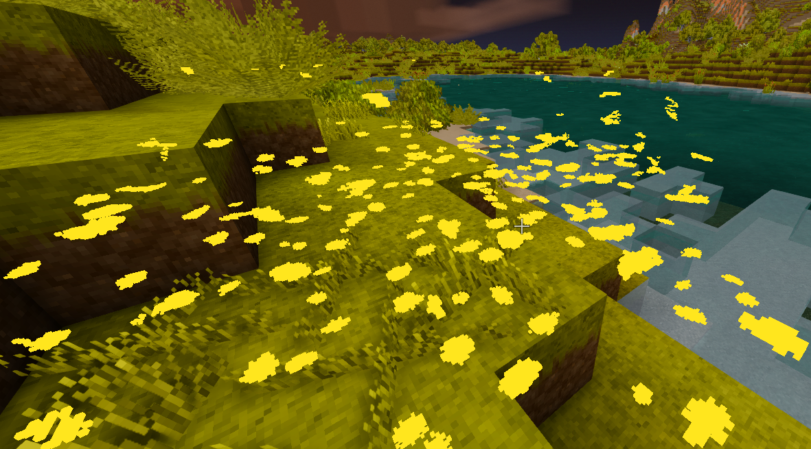
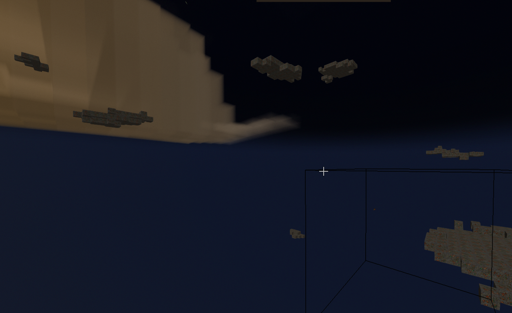

# Mod Menu

A client-side utility menu for Vintage Story 1.22. Press **F2** in game to open it.

Also on the [Vintage Story ModDB](https://mods.vintagestory.at/modmenu).






## Install

1. Download the zip from [Releases](../../releases) or the
   [ModDB page](https://mods.vintagestory.at/modmenu).
2. Drop it into `%APPDATA%\VintagestoryData\Mods`.
3. Start the game and press **F2**.

To update: close the game, delete the old `ModMenu` zip from that folder, drop in the new one,
start the game again. Nothing else to clean up — but do not leave two of them in there.

Your settings are saved in `ModConfig/modmenu.json`, so toggles, ESP targets and saved locations
survive a restart.

## What it does

**Player**

- **Invincibility** — blocks all incoming damage
- **One hit kill** — anything you hit dies
- **No hunger** — saturation stops draining
- **Fullbright** — caves and night become fully lit, no torches involved
- **Reach** — up to 100 blocks of extra reach for opening, breaking and placing

**Movement**

- **Flight** — free movement in any direction, 1x to 3x speed
- **No clip** — move through blocks
- **No fall damage** — landings stop hurting. Flying always breaks your fall, toggle or not

**Mining**

- **Instant mine** — blocks break in a single tick
- **Vein miner** — break one block of a vein and the rest goes with it, up to 400 blocks. The
  rest of the vein is painted red so you can see what the next swing takes
- **AntiAbuse Safe** — paces the vein miner so a server cannot ban you for it. Read
  [the warning below](#a-warning-about-vein-mining) before switching it off
- **No durability loss** — tools, weapons and armour never wear down
- **Drops at player** — what you mine lands at your feet instead of in the hole
- **Faster pickup** — collect items far quicker than the usual 23 a second

**ESP**

- Search for any block or creature, click it, and it gets painted in solid colour straight
  through the world — up to 500 blocks away
- Every target gets its own colour automatically. Click the colour square next to a target to
  change it
- **Transparent world** hides everything except what you are looking for. The world is only
  hidden, not gone: you can still walk on it and mine it

**Teleport**

- Type X/Y/Z coordinates and go, at any distance, without op rights or creative mode
- Three saveable locations you can rename
- Right-click the world map for **Teleport here**, alongside the usual waypoint options

## Not everything works on every server

Some of these are decided by your own game, and some by the server. On a normal server you do not
control, these work regardless:

> flight, no clip, no fall damage, teleport, fullbright, ESP, transparent world, instant mine,
> vein miner, and extra reach for opening and breaking blocks

These need the mod installed on the server too, and the menu greys them out with an explanation
when it is not:

> invincibility, one hit kill, no hunger, no durability loss, drops at player, faster pickup, and
> attacking creatures from range

Singleplayer runs both halves in one process, so everything works there.

If you run your own server, drop the same zip into its `Mods` folder and the greyed-out switches
start working for anyone who has the mod. Both sides need to be on the **same version**.

## A warning about vein mining

Breaking blocks quickly is not slowed down on a Vintage Story server — it is grounds for a **ban**.
The default is 40 blocks broken within 2 seconds, banned for 14 days, with no warning first.

**AntiAbuse Safe is on by default** and paces the vein miner so it stays under that line. Turning
it off breaks the whole vein at once, which is exactly the pattern servers ban for. It is safe in
singleplayer, and on servers that leave the setting off — but there is no way to check from the
outside which kind of server you are on.

Using this on a multiplayer server you do not own is very likely against its rules.

## A few things worth knowing

- **ESP range needs raising to see far.** The slider starts at 24 blocks. Ore deep underground is
  often 90+ blocks from the surface.
- **Fullbright can only light what your game has loaded.** If distance still looks dim, raise the
  view distance in the game's graphics settings — the default is 256 blocks.
- **F2 can be remapped** in Settings → Controls if it collides with something.
- **Flight tops out at 3x** on purpose. Faster than that and the landing starts costing health
  again on servers.
- **Vein miner counts the block you hit**, so a limit of 10 means that one plus nine more.
  Connected includes diagonals, since veins run that way as often as not.

## Building

Requires the .NET 10 SDK. The build finds Vintage Story through the `VINTAGE_STORY` environment
variable, falling back to `%APPDATA%\Vintagestory`.

```bash
dotnet build -c Release
```

The output lands in `bin/Release/`, and a ready-to-install zip in `dist/`, named with the version
from `modinfo.json`.

```bash
dotnet build -c Release -t:Deploy
```

installs it straight into your `Mods` folder. It refuses to run while the game is open, since
swapping the zip under a running game makes the next world load fail.

## How it works

The reasoning behind all of this — which parts of the game are client-authoritative and why, how
ESP scans without stuttering, what makes fullbright reach past 20 blocks, how teleporting gets
around the server's 128-block limit — is written up in
**[docs/internals.md](docs/internals.md)**.

## Licence

MIT. See [LICENSE](LICENSE).
